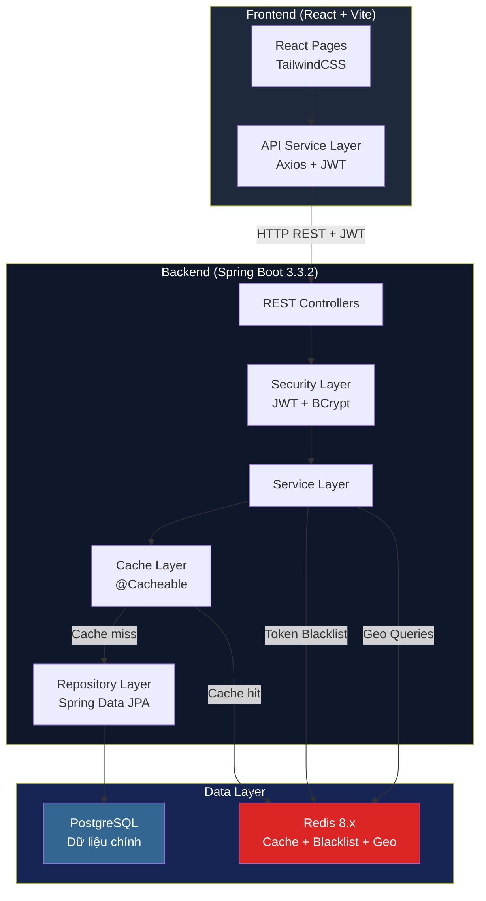
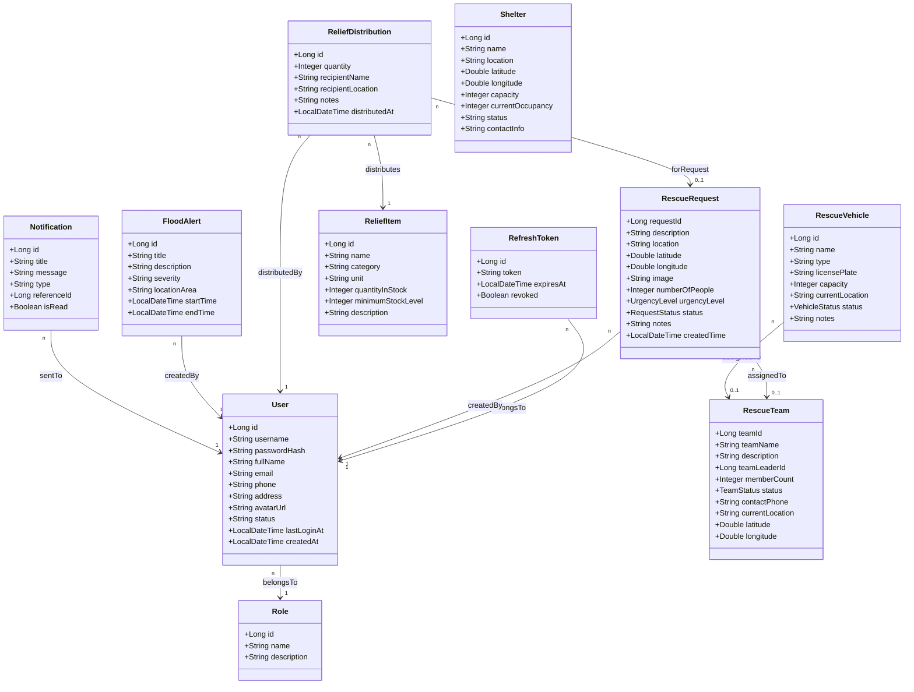
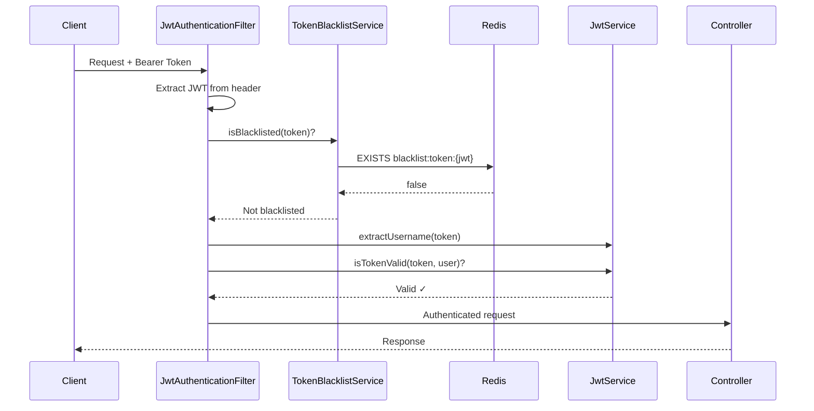
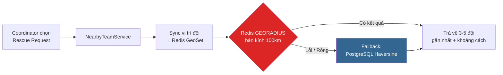
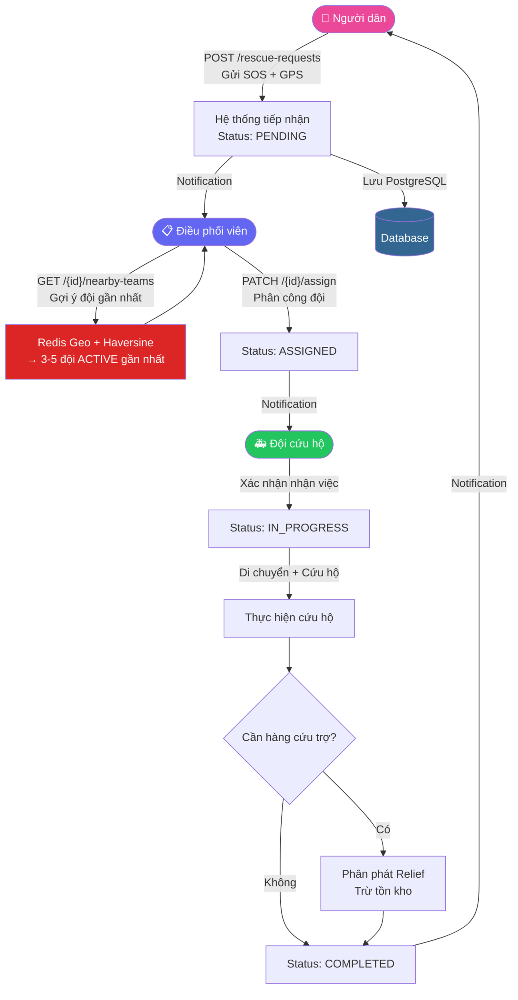
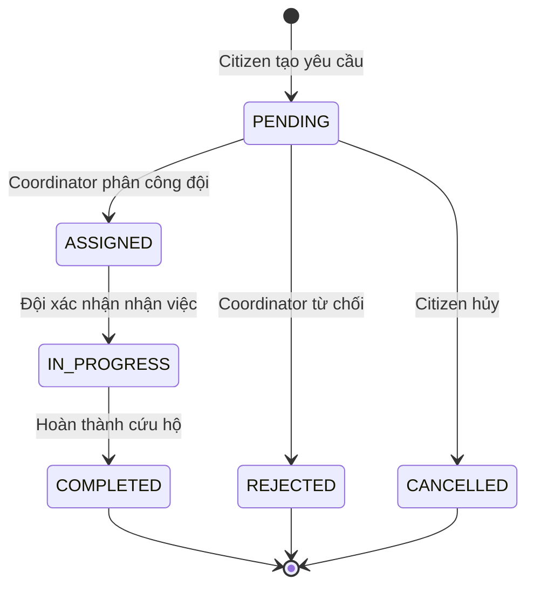

# Flood Rescue Coordination and Relief Management System
## Tài liệu Thiết kế Hệ thống

> **Hệ thống Điều phối Cứu hộ và Quản lý Cứu trợ Lũ lụt**
> Phiên bản: 2.0 | Cập nhật: 17/05/2026

---

## 1. Tổng quan Kiến trúc

### 1.1 Kiến trúc hệ thống



### 1.2 Công nghệ sử dụng

| Tầng | Công nghệ | Phiên bản |
|:---|:---|:---|
| **Frontend** | React + TypeScript + Vite | React 18, Vite 5 |
| **UI Framework** | TailwindCSS | 3.x |
| **Bản đồ** | Leaflet | – |
| **Backend** | Spring Boot | 3.3.2 |
| **ORM** | Hibernate / Spring Data JPA | 6.5.2 |
| **Bảo mật** | Spring Security + JWT (jjwt 0.12.6) | – |
| **Database** | PostgreSQL | – |
| **Cache / In-memory** | Redis | 8.6.3 |
| **API Docs** | Swagger / OpenAPI 3 (springdoc) | – |
| **Serialization** | Jackson + JavaTimeModule (JSR-310) | – |

---

## 2. Cấu trúc Dự án

```
flood-rescue-system/
├── client/                          # Frontend React
│   └── src/
│       ├── api/http.ts              # Axios instance + interceptor JWT
│       ├── services/                # API service layer
│       │   ├── apiService.ts        # CRUD cho tất cả entities
│       │   ├── authService.ts       # Login/Register/Logout
│       │   └── sessionStorage.ts    # Token management
│       ├── pages/                   # 14 trang giao diện
│       │   ├── LoginPage.tsx
│       │   ├── RegisterPage.tsx
│       │   ├── DashboardPage.tsx
│       │   ├── MapPage.tsx          # Bản đồ Leaflet
│       │   ├── RescueRequestsPage.tsx
│       │   ├── TeamsPage.tsx
│       │   ├── VehiclesPage.tsx
│       │   ├── SheltersPage.tsx
│       │   ├── AlertsPage.tsx
│       │   ├── ReliefPage.tsx
│       │   ├── NotificationsPage.tsx
│       │   ├── UsersPage.tsx
│       │   ├── AdminUsersPage.tsx
│       │   └── ProfilePage.tsx
│       ├── components/              # UI components tái sử dụng
│       ├── hooks/                   # Custom React hooks
│       ├── store/                   # State management
│       └── routes/                  # React Router config
│
├── server/                          # Backend Spring Boot
│   └── src/main/java/.../
│       ├── config/
│       │   ├── RedisConfig.java     # Cache + RedisTemplate + JavaTimeModule
│       │   ├── OpenApiConfig.java   # Swagger config
│       │   └── DataInitializer.java # Seed dữ liệu ban đầu
│       ├── controller/              # 10 REST Controllers
│       ├── service/                 # 12 Service classes
│       ├── repository/              # 11 JPA Repositories
│       ├── entity/                  # 13 Entity classes
│       ├── dto/
│       │   ├── request/             # 15 Request DTOs
│       │   └── response/            # 13 Response DTOs
│       ├── security/
│       │   ├── SecurityConfig.java
│       │   ├── JwtService.java
│       │   ├── JwtAuthenticationFilter.java
│       │   └── CustomUserDetailsService.java
│       └── exception/               # Global exception handling
│
├── test_data.sql                    # Script dữ liệu mẫu
└── DESIGN.md                       # Tài liệu này
```

---

## 3. Sơ đồ Lớp Dữ liệu (Class Diagram)



### 3.1 Enums

| Enum | Giá trị |
|:---|:---|
| **RequestStatus** | `PENDING` → `ASSIGNED` → `IN_PROGRESS` → `COMPLETED` / `CANCELLED` / `REJECTED` |
| **UrgencyLevel** | `LOW`, `MEDIUM`, `HIGH`, `CRITICAL` |
| **TeamStatus** | `ACTIVE`, `INACTIVE`, `ON_DUTY` |
| **VehicleStatus** | `AVAILABLE`, `IN_USE`, `MAINTENANCE`, `DECOMMISSIONED` |

---

## 4. API Endpoints

### 4.1 Authentication (`/api/auth`)

| Method | Endpoint | Mô tả |
|:---|:---|:---|
| POST | `/api/auth/register` | Đăng ký (mặc định role CITIZEN) |
| POST | `/api/auth/login` | Đăng nhập, nhận JWT |
| POST | `/api/auth/refresh` | Refresh access token |
| POST | `/api/auth/logout` | Logout – blacklist token vào Redis |

### 4.2 Rescue Requests (`/api/rescue-requests`)

| Method | Endpoint | Mô tả | Role |
|:---|:---|:---|:---|
| POST | `/` | Tạo yêu cầu cứu hộ | CITIZEN |
| GET | `/my-requests` | Xem yêu cầu của tôi | CITIZEN |
| PATCH | `/{id}/confirm-rescued` | Xác nhận đã được cứu | CITIZEN |
| PATCH | `/{id}/location` | Cập nhật vị trí SOS | CITIZEN |
| GET | `/` | Xem tất cả yêu cầu | COORDINATOR |
| GET | `/{id}` | Chi tiết yêu cầu | ALL |
| GET | `/status/{status}` | Lọc theo trạng thái | COORDINATOR |
| **GET** | **`/{id}/nearby-teams?limit=5`** | **Gợi ý đội cứu hộ gần nhất (Redis Geo + Haversine)** | **COORDINATOR** |
| PATCH | `/{id}/assign` | Phân công đội cứu hộ | COORDINATOR |
| PATCH | `/{id}/status` | Cập nhật trạng thái | COORDINATOR |
| PATCH | `/{id}/urgency` | Cập nhật mức khẩn cấp | COORDINATOR |
| PUT | `/{id}` | Cập nhật yêu cầu | COORDINATOR |
| DELETE | `/{id}` | Xóa yêu cầu | ADMIN |
| GET | `/team/{teamId}` | Xem nhiệm vụ đội | RESCUER |

### 4.3 Rescue Teams (`/api/rescue-teams`)

| Method | Endpoint | Mô tả |
|:---|:---|:---|
| GET | `/` | Danh sách đội (cached 180s) |
| GET | `/{id}` | Chi tiết đội (cached) |
| POST | `/` | Tạo đội mới |
| PUT | `/{id}` | Cập nhật đội |
| DELETE | `/{id}` | Xóa đội |

### 4.4 Shelters (`/api/shelters`)

| Method | Endpoint | Mô tả |
|:---|:---|:---|
| GET | `/` | Danh sách nơi trú ẩn (cached 300s) |
| GET | `/{id}` | Chi tiết (cached) |
| POST | `/` | Tạo mới |
| PUT | `/{id}` | Cập nhật |
| DELETE | `/{id}` | Xóa |

### 4.5 Flood Alerts (`/api/flood-alerts`)

| Method | Endpoint | Mô tả |
|:---|:---|:---|
| GET | `/` | Danh sách cảnh báo (cached 120s) |
| GET | `/{id}` | Chi tiết (cached) |
| POST | `/` | Tạo cảnh báo mới |

### 4.6 Vehicles (`/api/vehicles`), Relief (`/api/relief`), Admin (`/api/admin`), Users, Notifications

> Các module CRUD đầy đủ tương tự, xem Swagger UI tại `http://localhost:8080/swagger-ui.html`.

---

## 5. Bảo mật (Security)

### 5.1 Kiến trúc xác thực



### 5.2 JWT Token

| Thuộc tính | Giá trị |
|:---|:---|
| **Algorithm** | HS512 |
| **Access Token TTL** | 15 phút (900,000 ms) |
| **Refresh Token TTL** | 7 ngày (604,800,000 ms) |
| **Claims** | `sub` (username), `role`, `iat`, `exp` |

### 5.3 Phân quyền RBAC

| Role | Quyền hạn |
|:---|:---|
| **ADMIN** | Quản lý toàn bộ hệ thống, quản lý tài khoản, xem dashboard thống kê |
| **COORDINATOR** | Xem tất cả yêu cầu cứu hộ, điều phối đội cứu hộ, gợi ý đội gần nhất, cập nhật trạng thái |
| **MANAGER** | Quản lý kho hàng cứu trợ, phương tiện, điểm an toàn, phát cảnh báo lũ |
| **RESCUER** | Xem nhiệm vụ được phân công, cập nhật trạng thái nhiệm vụ, phát hàng cứu trợ |
| **CITIZEN** | Gửi yêu cầu cứu hộ, xem trạng thái, cập nhật vị trí SOS, xem cảnh báo lũ |

### 5.4 Logout (Token Blacklist)

Khi user logout → JWT được lưu vào Redis key `blacklist:token:{jwt}` với TTL = thời gian token còn hợp lệ. Mọi request tiếp theo với token đã blacklist sẽ bị từ chối tại `JwtAuthenticationFilter`.

---

## 6. Redis Integration

### 6.1 Tổng quan

Redis phục vụ **3 mục đích** trong hệ thống:

| Chức năng | Redis Key Pattern | TTL |
|:---|:---|:---|
| **Cache API** | `{cacheName}::{key}` | Tùy cache (60s–300s) |
| **JWT Blacklist** | `blacklist:token:{jwt}` | = thời gian token còn hợp lệ |
| **Geo vị trí đội** | `geo:rescue_teams` | Cập nhật realtime |

### 6.2 Cache Configuration

| Cache Name | TTL | Service | Trigger |
|:---|:---|:---|:---|
| `dashboard` | 60s | `AdminService.getDashboardStats()` | `GET /api/admin/dashboard` |
| `floodAlerts` | 120s | `FloodAlertService` | `GET /api/flood-alerts` |
| `rescueTeams` | 180s | `RescueTeamService` | `GET /api/rescue-teams` |
| `shelters` | 300s | `ShelterService` | `GET /api/shelters` |

**Cache Eviction**: Khi dữ liệu thay đổi (create/update/delete), `@CacheEvict(allEntries = true)` tự động xóa toàn bộ cache tương ứng.

### 6.3 Gợi ý đội cứu hộ gần nhất (Redis Geo + Haversine)



**Công thức Haversine** (tính khoảng cách 2 điểm trên Trái Đất):
```
d = 6371 × acos(cos(φ₁)·cos(φ₂)·cos(λ₂−λ₁) + sin(φ₁)·sin(φ₂))
```

---

## 7. Luồng Nghiệp vụ Chính

### 7.1 Luồng xử lý Yêu cầu Cứu hộ



### 7.2 Vòng đời Yêu cầu Cứu hộ



---

## 8. Cấu hình Môi trường

### 8.1 application.properties

```properties
# Database
spring.datasource.url=jdbc:postgresql://localhost:5432/flood_rescue_db
spring.datasource.username=postgres
spring.datasource.password=1234

# JPA
spring.jpa.hibernate.ddl-auto=update
spring.jpa.properties.hibernate.dialect=org.hibernate.dialect.PostgreSQLDialect

# JWT
app.jwt.secret=0123456789ABCDEF... (64 ký tự)
app.jwt.access-expiration=900000
app.jwt.refresh-expiration=604800000

# Redis
spring.data.redis.host=localhost
spring.data.redis.port=6379

# Cache TTL (seconds)
app.cache.ttl.dashboard=60
app.cache.ttl.shelters=300
app.cache.ttl.flood-alerts=120
app.cache.ttl.rescue-teams=180

# Swagger
springdoc.swagger-ui.path=/swagger-ui.html
```

### 8.2 Khởi chạy hệ thống

```bash
# 1. PostgreSQL (port 5432) - phải chạy trước
# 2. Redis (port 6379)
Start-Process "redis\Redis-8.6.3-Windows-x64-msys2\redis-server.exe" -WindowStyle Hidden

# 3. Backend (port 8080)
cd server && .\mvnw.cmd spring-boot:run

# 4. Frontend (port 5173)
cd client && npm run dev
```

| Service | URL |
|:---|:---|
| Frontend | http://localhost:5173 |
| Backend API | http://localhost:8080 |
| Swagger UI | http://localhost:8080/swagger-ui.html |
| Redis | localhost:6379 |
| PostgreSQL | localhost:5432 |

---

## 9. Dependencies (pom.xml)

| Dependency | Mục đích |
|:---|:---|
| `spring-boot-starter-web` | REST API |
| `spring-boot-starter-data-jpa` | ORM / Hibernate |
| `spring-boot-starter-security` | Authentication & Authorization |
| `spring-boot-starter-validation` | DTO validation |
| `spring-boot-starter-data-redis` | Redis cache + Geo + Token blacklist |
| `jackson-datatype-jsr310` | LocalDateTime serialization cho Redis |
| `postgresql` | PostgreSQL JDBC driver |
| `jjwt-api` / `jjwt-impl` / `jjwt-jackson` | JWT token |
| `springdoc-openapi-starter-webmvc-ui` | Swagger UI |
