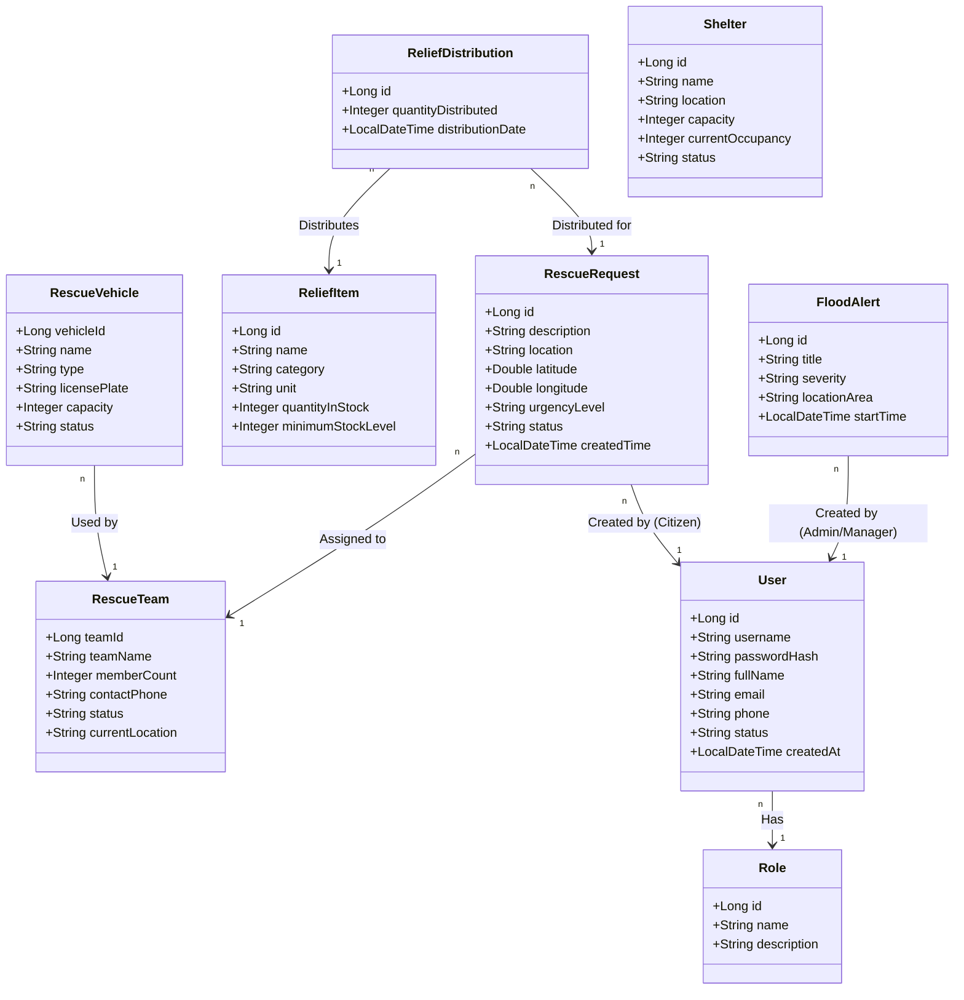
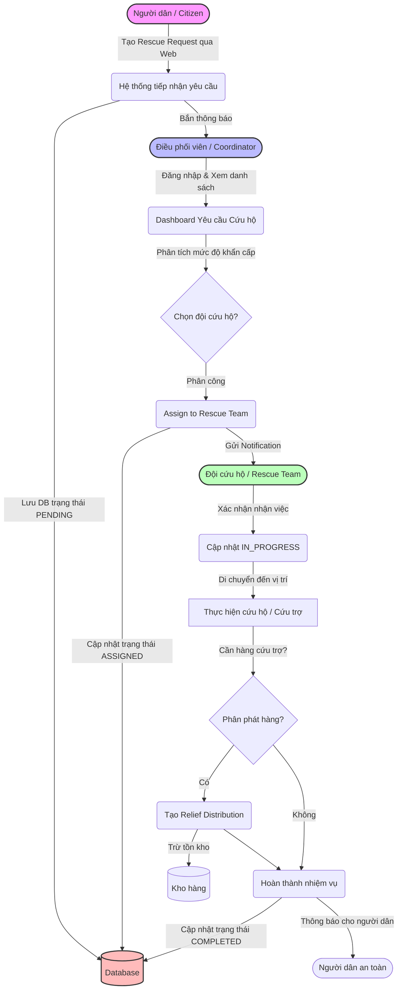

# Flood Rescue Coordination and Relief Management System
## System Architecture & Design Documentation

Tài liệu này mô tả chi tiết về cấu trúc dữ liệu (Class Diagram) và luồng hoạt động chính (Flowchart) của Hệ thống Điều phối Cứu hộ và Quản lý Cứu trợ Lũ lụt.

---

### 1. Sơ đồ mô hình lớp dữ liệu (Class Diagram)
Sơ đồ dưới đây thể hiện các thực thể chính trong hệ thống và mối quan hệ giữa chúng, bao gồm Quản lý người dùng, Đội cứu hộ, Yêu cầu cứu hộ, Hàng cứu trợ và Điểm an toàn.

---

### 2. Sơ đồ luồng nghiệp vụ cốt lõi (Flowchart)
Sơ đồ dưới đây mô tả luồng nghiệp vụ quan trọng nhất của hệ thống: **Tiếp nhận và xử lý yêu cầu cứu hộ khẩn cấp.**

---

### 3. Phân quyền Hệ thống (Role-Based Access Control)

| Vai trò (Role) | Chức năng chính được phép |
| :--- | :--- |
| **ADMIN** | Quản lý toàn bộ hệ thống, quản lý tài khoản người dùng, xem thống kê tổng hợp. |
| **COORDINATOR** | Xem tất cả yêu cầu cứu hộ, điều phối Đội cứu hộ (Rescue Team) đi làm nhiệm vụ, thay đổi trạng thái yêu cầu. |
| **MANAGER** | Quản lý kho hàng cứu trợ (Relief Items), quản lý phương tiện cứu hộ (Vehicles) và Điểm an toàn (Shelters), phát Cảnh báo lũ. |
| **RESCUER** | (Đội cứu hộ) Xem các nhiệm vụ được phân công, cập nhật trạng thái nhiệm vụ (Đang đi, Đã xong), cập nhật phát hàng cứu trợ. |
| **CITIZEN** | (Người dân) Gửi yêu cầu cứu hộ khẩn cấp, xem trạng thái yêu cầu của mình, nhận cảnh báo lũ lụt và tìm điểm an toàn. |
